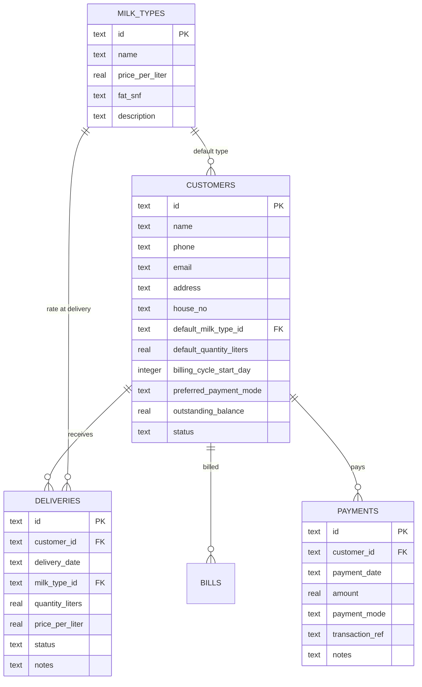

# 🥛 Milk-Dairy-Flow (DairyFlow Pro)

> **High-Performance Farm-Fresh Milk Delivery Dispatch & Smart Monthly Billing System**  
> Tailored for local dairies, milk delivery vendors, and dhoodhwalas with real-time customer tracking, 60 FPS mobile-first UI, and automated cycle billing.

---

## 🌟 Overview

**Milk-Dairy-Flow** solves the everyday challenges of dairy distribution businesses. Traditional paper registers and manual notebooks are error-prone, hard to calculate at the end of the month, and frequently lead to disputes over skipped days or partial payments.

This application provides:
1. **An Admin Command Center** for 1-touch daily morning dispatch checklist, flexible milk pricing, customer management, and collection reminders.
2. **A Customer Self-Service Passbook** allowing customers to transparently view their daily milk deliveries, total monthly liters, itemized bill calculations, and pay directly via UPI.

---

## 🚀 Key Features

### 1. 📱 Daily Delivery Dispatch Checklist ("Sticky Box" Tracker)
- **1-Touch Mobile Dispatch**: Built for fast thumb interaction on mobile devices at 60 FPS.
  - **Delivered (Green)**: Marks standard quota (e.g. 1.0 L or 1.5 L).
  - **Absent / Not at Home (Red)**: 1-click marks customer absent (0 Liters) so their monthly bill never overcharges them.
  - **Custom Quantity & Huge Orders**: Quick buttons for **500 ml**, **1.0 L**, **1.5 L**, **2.0 L**, **2.5 L**, or large festival orders (up to 5.0 L+).
- **Sticky Floating Summary Bar**: Stays pinned at the bottom on mobile screens, displaying:
  - Total homes delivered vs pending
  - Total milk liters dispatched today
  - 1-click **"Mark Remaining Delivered"** button
- **Independent Per-House Tracking**: Every house (House A, Flat B, Villa C) has its own independent calendar ledger.

### 2. 📅 Flexible Billing Engine & 2-Day Advance Alerts
- **Arbitrary Cycle Start Dates**: Customers can begin milk service on any date (e.g., **26th September**). The system calculates their 30/31-day cycle ending on the **26th of the next month**.
- **2-Day Advance Pop-Up Alert**: Automatically triggers 2 days before the billing cycle date (e.g., on 24th October for a 26th October cycle):
  - Displays customer name and house number
  - Total milk consumption in Liters
  - Calculated current bill amount ($\text{Liters} \times \text{Milk Rate}$)
  - Total pending balance
- **10th of Every Month Collection Reminder**: Dedicated banner reminding admin to collect monthly bills on the 10th.
- **Partial Payments & Automatic Balance Rollover**:
  - If a customer bill is **₹1,800** and they pay **₹1,000** via Cash or UPI:
  - System logs ₹1,000 paid with receipt reference.
  - The remaining balance of **₹800** is preserved and automatically rolls over to their next monthly statement!
- **1-Click WhatsApp Bill Share**: Generates a pre-formatted WhatsApp statement with delivery dates, total liters, breakdown, and pending balance to copy or open directly in WhatsApp.
- **Printable Invoices**: Clean printable bill invoices for customers requiring physical receipts.

### 3. 🥛 Live Milk Rates & Price Fluctuations
- Real-time rate management across multiple milk varieties:
  - **Standard Cow Milk**: ₹60 / Liter (Default base rate)
  - **Pure Buffalo Milk**: ₹70 / Liter
  - **Full Cream Gold Milk**: ₹78 / Liter
  - **Desi Gir Cow A2 Milk**: ₹85 / Liter
- Adjust rates at any time via the Admin rates panel; updated rates immediately apply to all ongoing and subsequent calculations.

### 4. 👤 Customer Passbook Portal
- Read-only transparent portal for customers:
  - View daily delivery attendance calendar (Delivered vs Absent dates).
  - Live monthly consumption counter (e.g., 29.5 Liters).
  - Transparent price breakdown ($\text{Liters} \times \text{Rate} + \text{Carried Dues} - \text{Payments}$).
  - Quick UPI payment with integrated QR code (compatible with Google Pay, PhonePe, Paytm).

### 5. 🔐 OTP Verification & Google Sign-In
- **Email & Mobile SMS OTP Flow**:
  - Request 6-digit verification code sent to email or phone number.
  - Test mode included with instant 1-click **Auto-fill** chip for rapid testing.
- **Google Sign-In**: 1-click Google authentication.
- **Role Switcher**: Seamlessly toggle between Admin View and Customer View from the top navigation bar.

---

## 🏗️ Architecture & Tech Stack

```
Milk-Dairy-Flow/
├── client/                     # Vite + React 19 Frontend
│   ├── src/
│   │   ├── components/         # UI Components
│   │   │   ├── Navbar.jsx          # Header, brand, rate glance, alert bell, auth
│   │   │   ├── DailyTracker.jsx    # Sticky mobile delivery checklist & quick toggle
│   │   │   ├── CustomerList.jsx    # Customer directory & Add/Edit modal
│   │   │   ├── BillingModal.jsx    # Cycle calculation, partial payments, WhatsApp share
│   │   │   ├── MilkRatesModal.jsx  # Rate fluctuation manager
│   │   │   ├── DueAlertsBanner.jsx # 2-Day advance cycle alert & 10th collection alert
│   │   │   ├── CustomerPortal.jsx  # Read-only customer passbook & UPI QR
│   │   │   └── AuthModal.jsx       # Mobile/Email OTP verification & Google login
│   │   ├── services/
│   │   │   └── api.js              # Centralized REST API client
│   │   ├── App.jsx             # Main controller orchestrating views and modals
│   │   ├── main.jsx            # React root mount
│   │   └── index.css           # Tailwind directives & 60 FPS touch animations
│   ├── tailwind.config.js      # Custom theme colors (dairy teal & warm cream)
│   ├── vite.config.js          # Port 3000, network host: true, backend proxy
│   └── package.json
│
├── server/                     # Node.js + Express Backend
│   ├── db.js                   # SQLite database (WAL mode), schema & seed data
│   ├── index.js                # Express REST API routes & static client server
│   └── dairy.db                # SQLite database storage file
│
├── package.json                # Root package with concurrent dev scripts
└── README.md                   # Full documentation & project material
```

---

## 🗄️ Database Schema

The database utilizes SQLite with Write-Ahead Logging (`WAL` mode) for fast, zero-configuration local persistence:



---

## ⚡ Getting Started

### Prerequisites
- [Node.js](https://nodejs.org/) (v18.0.0 or higher, v22 recommended)
- `npm` (v9 or higher)

### Installation

1. **Clone the repository**:
   ```bash
   git clone https://github.com/svs7777777/Milk-Dairy-Flow.git
   cd Milk-Dairy-Flow
   ```

2. **Install Root & Server Dependencies**:
   ```bash
   npm install
   ```

3. **Install Client Dependencies**:
   ```bash
   cd client
   npm install
   cd ..
   ```

---

## 🚦 Running the Application

### Option A: Development Mode (Hot-Reload Enabled)
Runs both the Express API backend and Vite client concurrently:
```bash
npm run dev
```
- Frontend UI: `http://localhost:3000`
- Backend API: `http://localhost:5000`

### Option B: Production Server
Builds the client and serves everything from the Express server:
```bash
npm run build
npm start
```
- Complete Application: `http://localhost:5000`

---

## 📱 Mobile Device Access

### On the Same Wi-Fi / Hotspot:
1. Find your computer's local IP address (e.g. `192.168.1.15` or `10.31.168.60`).
2. On any smartphone connected to the same Wi-Fi, open:
   ```text
   http://YOUR_LOCAL_IP:5000
   ```

### Over Cellular Mobile Data (4G / 5G / Remote):
Run a secure tunnel using localtunnel or cloudflared:
```bash
npx localtunnel --port 5000 --subdomain dairyflow-pro
```

---

## 📡 REST API Reference

| Endpoint | Method | Description |
| :--- | :---: | :--- |
| `/api/dashboard/stats` | `GET` | Aggregated dashboard stats (today's liters, delivered, month total, dues) |
| `/api/deliveries/date/:date` | `GET` | Get delivery checklist for all active customers on a given date |
| `/api/deliveries/save` | `POST` | Record/toggle delivery (Delivered standard, Absent 0L, or custom liters) |
| `/api/deliveries/mark-all-delivered` | `POST` | Batch mark all remaining pending customers as delivered for a date |
| `/api/customers` | `GET` | List all active customers with their milk rates and cycle info |
| `/api/customers` | `POST` | Add a new customer in real-time |
| `/api/customers/:id` | `PUT` | Update customer details, quota, or billing cycle day |
| `/api/customers/:id` | `DELETE` | Soft-delete customer |
| `/api/customers/:id/report` | `GET` | Full monthly cycle calculation, consumption, and balance breakdown |
| `/api/billing/due-alerts` | `GET` | Check for 2-day advance cycle alerts, 10th collection alerts & pending dues |
| `/api/milk-types` | `GET` | List all milk types and current prices |
| `/api/milk-types/:id` | `PUT` | Update per-liter milk price (reflects immediately on billing) |
| `/api/payments` | `POST` | Record payment (Cash or UPI) with partial payment & balance rollover |
| `/api/auth/send-otp` | `POST` | Generate 6-digit OTP for email/phone |
| `/api/auth/verify-otp` | `POST` | Verify OTP code and authenticate session |

---

## 📄 License
This project is licensed under the ISC License.
